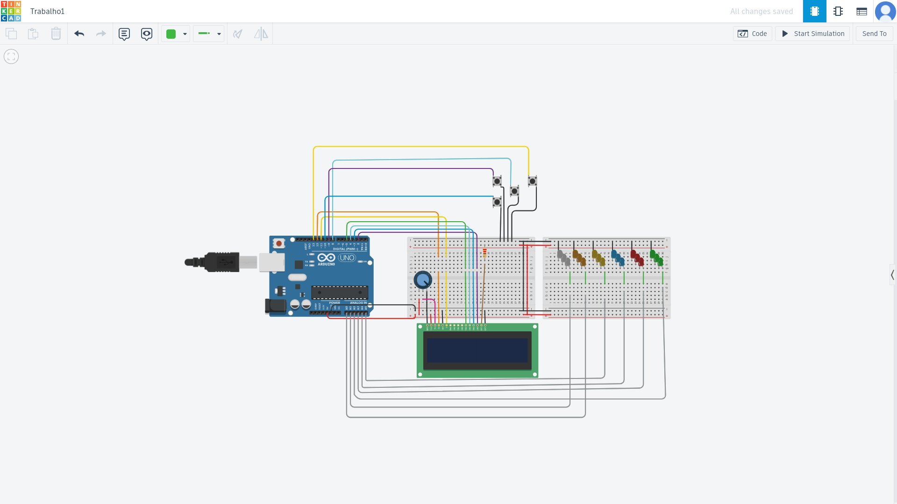

# Projeto Arduino: Menu Musical Interativo com LCD e LEDs

Este projeto implementa um **menu interativo com display LCD 16x2** e **controle de seis LEDs coloridos** via Arduino UNO. O sistema permite navegar entre músicas, executar sequências de luzes, ajustar a velocidade das execuções e ativar um modo festa, tudo controlado por quatro botões.

---

## ⚙️ Materiais Utilizados

| Quantidade | Componente              |
|------------|--------------------------|
| 1          | Arduino UNO              |
| 1          | Display LCD 16x2         |
| 1          | Protoboard               |
| 6          | LEDs (amarelo, azul, vermelho, verde, laranja, branco) |
| 6          | Resistores 220Ω          |
| 4          | Botões push-button       |
| Cabos jumper | Macho-Macho             |

---

## 🔌 Ligações

### Display LCD:

| LCD Pin | Arduino Pin |
|---------|-------------|
| RS      | 12          |
| EN      | 11          |
| D4      | 5           |
| D5      | 4           |
| D6      | 3           |
| D7      | 2           |

### Botões:

| Função           | Pino Arduino |
|------------------|--------------|
| Botão Cima       | 9            |
| Botão Baixo      | 10           |
| Botão Seleciona  | 8            |
| Botão Voltar     | 13           |

Todos os botões usam resistores pull-up internos (`INPUT_PULLUP`).

### LEDs:

| Cor     | Nome no Código | Pino Arduino |
|---------|---------------|--------------|
| Amarelo | L_YE          | A5           |
| Azul    | L_BU          | A4           |
| Vermelho| L_RE          | A3           |
| Verde   | L_GR          | A2           |
| Laranja | L_OR          | A0           |
| Branco  | L_WH          | A1           |

---

## 📋 Funcionamento do Menu

- O menu é exibido no LCD e navegado com os botões:
  - 🔼 **Cima (9)**: Sobe no menu
  - 🔽 **Baixo (10)**: Desce no menu
  - ✅ **Seleciona (8)**: Executa a ação do item atual
  - ⬅️ **Voltar (13)**: Retorna ao menu anterior/submenu

### Estrutura do Menu

1. **circles - Post**
   - Executa a música "Circles" (sequência de LEDs)
   - Após execução, entra no submenu para ajuste de velocidade
2. **Baby - Justin**
   - Executa a música "Baby" (sequência de LEDs)
   - Após execução, entra no submenu para ajuste de velocidade
3. **Because of you**
   - Executa a música "Because of you" (sequência de LEDs)
   - Após execução, entra no submenu para ajuste de velocidade
4. **Party Mode**
   - Ativa o modo festa, onde LEDs piscam em padrões temporizados

#### Submenus de Velocidade
Após executar uma música, o menu entra em um submenu (11, 21, 31) que permite aumentar a velocidade da música pressionando o botão Seleciona.

---

## 🎵 Descrição das Músicas e Modos

### 1. Circles - Post (menu 1)
- LEDs acendem em sequência: Amarelo → Laranja → Branco → Azul → Vermelho → Verde
- Sequência se repete 3 vezes
- Velocidade controlada pela variável `vel_song1` (padrão: 300ms)
- Após execução, submenu 11 permite aumentar a velocidade (reduzindo o valor de `vel_song1` em 50ms a cada seleção)

### 2. Baby - Justin (menu 2)
- Todos os LEDs acendem juntos, depois apagam, depois só o vermelho pisca
- Sequência se repete 12 vezes
- Velocidade controlada por `vel_song2` (padrão: 150ms)
- Após execução, submenu 21 permite aumentar a velocidade

### 3. Because of you (menu 3)
- LEDs piscam em pares e depois todos juntos
- Sequência se repete 3 vezes
- Velocidade controlada por `vel_song31` e `vel_song32` (padrão: 350ms e 500ms)
- Após execução, submenu 31 permite aumentar a velocidade

### 4. Party Mode (menu 4)
- LEDs piscam em padrões temporizados, controlados pelas funções de temporização
- Sai do modo festa pressionando o botão Voltar

---

## ⏱️ Temporizações

O sistema utiliza tarefas periódicas para criar efeitos de pisca-pisca:
- **Coisas_5_mili**: Executada a cada 5ms (pisca Branco e Verde)
- **Coisas_100_mili**: Executada a cada 100ms (pisca Laranja e Vermelho)
- **Coisas_500_mili**: Executada a cada 500ms (pisca Amarelo e Azul)
- **Coisas_1000_mili**: Executada a cada 1000ms
- **Coisas_2000_mili**: Executada a cada 2000ms
- **Coisas_4000_mili**: Executada a cada 4000ms

---

## ⚡ Variáveis de Velocidade

- `vel_song1`, `vel_song2`, `vel_song31`, `vel_song32`: Controlam a velocidade das músicas. Podem ser ajustadas nos submenus após cada execução.

---

## 📚 Bibliotecas Utilizadas

- `LiquidCrystal`: Para controle do display LCD

---

## 🔧 Configuração e Uso

1. Monte o circuito conforme as ligações acima
2. Carregue o código para o Arduino
3. Use os botões para navegar e executar as músicas ou ativar o modo festa
4. Ajuste a velocidade das músicas nos submenus
5. Use o botão Voltar para retornar ao menu principal

---

## 🛠️ Manutenção e Expansão

- Para adicionar novas músicas, crie novas funções `acaoX()` e adicione ao menu
- Para alterar o menu, edite a função `AtualizaMenu()`
- Para modificar padrões de pisca, altere as funções de temporização
- Para expandir o número de LEDs, ajuste as definições de pinos e lógica

---

## 💡 Dicas
- Sempre utilize resistores para os LEDs
- Use o monitor serial para depuração, se necessário
- Os valores mínimos de velocidade são limitados a 50ms para evitar travamentos
